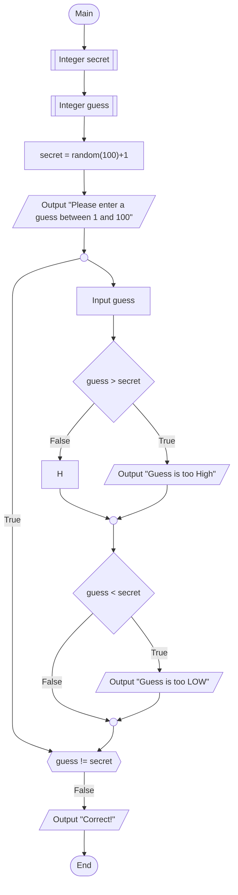

FlowChart Description:  
Integer Secret: Creates the secret integer 
Integer Guess: Integer for guess 
Secret=random(100)+1: Randomizes secret integer 
Output "Please enter a guess between 1 and 100" : Provides the original output to prompt user to enter an integer 
Input Guess: What the user inputs as an integer 
Guess > secret: True or false depending on user input and value of the randomized secret integer 
Guess < Secret: True or false depending on user input and value of the randomized secret integer 
Output Low or High: Will notify user that guess is to low or high 
Guess !=secret: Will determine if guess is correct or not either looping back to Input guess or output of correct answer 
Output Correct: Notifies user that answer is correct.