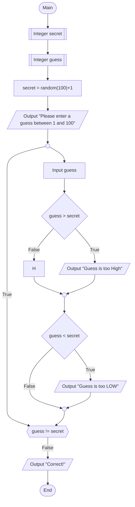

```mermaid
flowchart TD
	Main([Main]) --> 
	A[[Integer secret]] -->
	B[[Integer guess]] -->
	C["secret = random(100)+1"] -->
    D[/Output "Please enter a guess between 1 and 100"/] -->
    E(( )) -->|True|N
    E-->F 
    F[Input guess] --> G
    G{guess > secret}
    G-->|False|H
    G-->|True|I
    H-->J
    I[/Output "Guess is too High"/]
    I-->J
    J(( ))
    J-->K
    K{guess < secret}
    K-->|False|M
    K-->|True|L
    L[/Output "Guess is too LOW"/]
    L-->M
    M(( ))
    M-->N
    N{{guess != secret}}-->|False|O
    O[/Output "Correct!"/]-->End
    End([End])
```